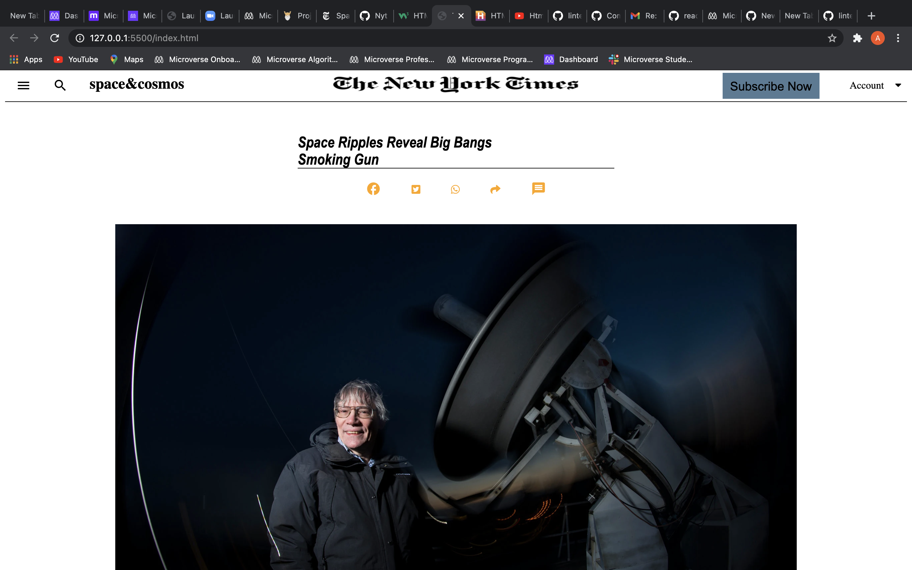

# Project Name: Sneak Peak Project

> This project is Mainly focused in Building the repleca of New York Times Article page. to build this project Html and css languges were used.

## Built With

- Major languages: HTML & CSS

## Live Demo

[Live Demo Link](https://livedemo.com)

### Prerequisites

- Computer
- Internet Connection
- basic Knowledge of Html and css

### Setup

- Vs Code
- Git
- github

### Install

- VS code
- Git
- Github

## Authors

👤 **Author1**

- GitHub: [@githubAddis0943](https://github.com/Addis0943) -[LinkedIn](https://www.linkedin.com/in/addis-belete-134b98191/)

## 🤝 Contributing

## Show your support

## Acknowledgments

## 📝 License

This project is [MIT](lic.url) licensed.
sa
